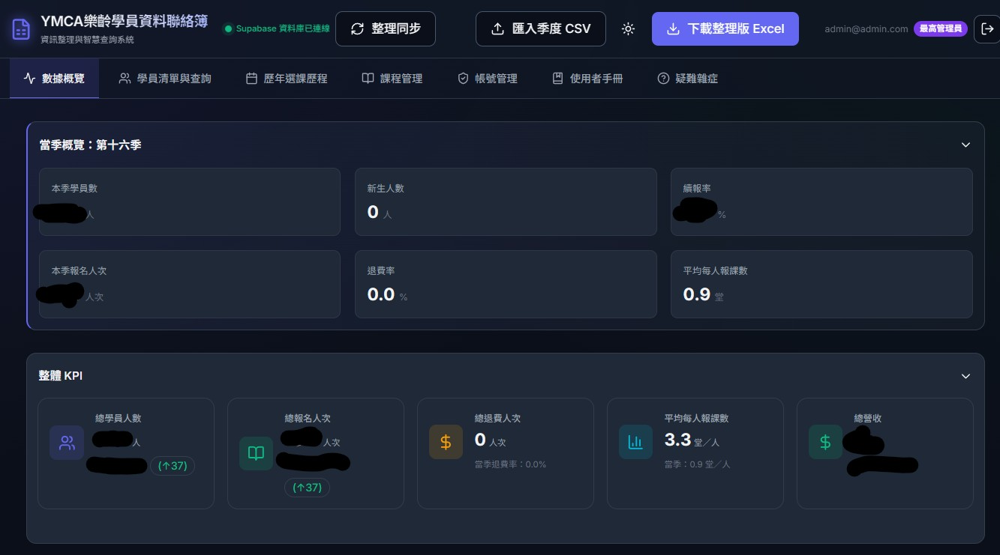
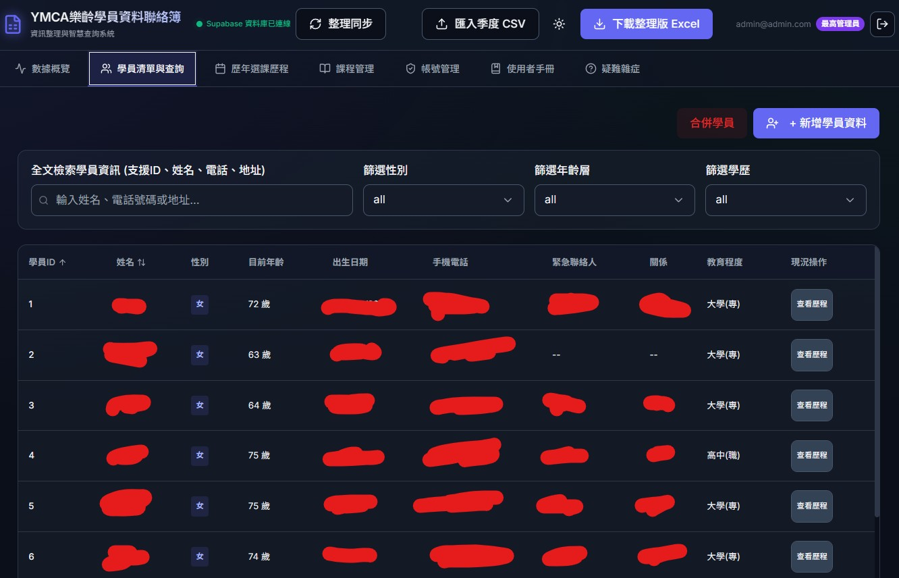
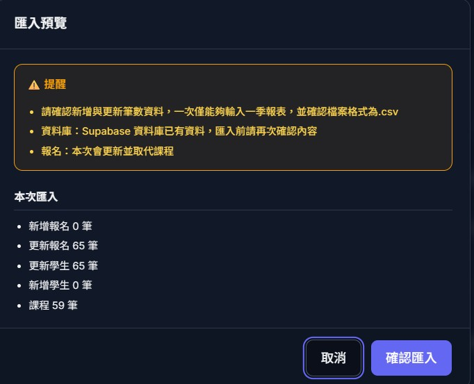
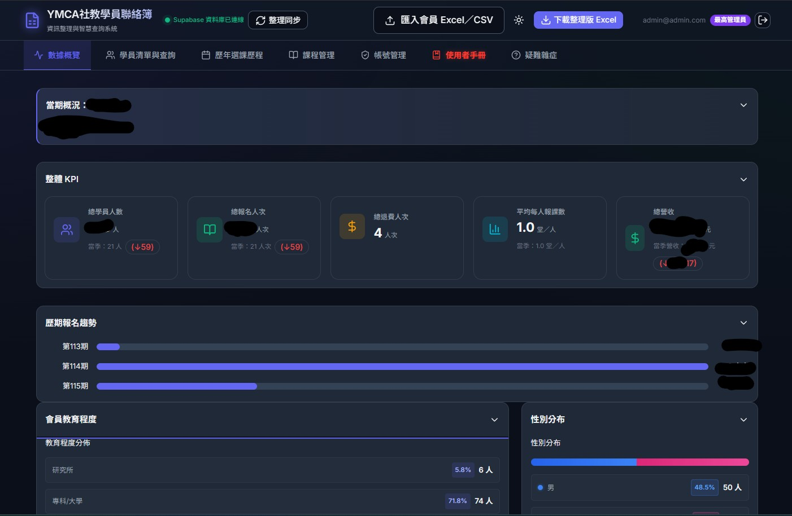
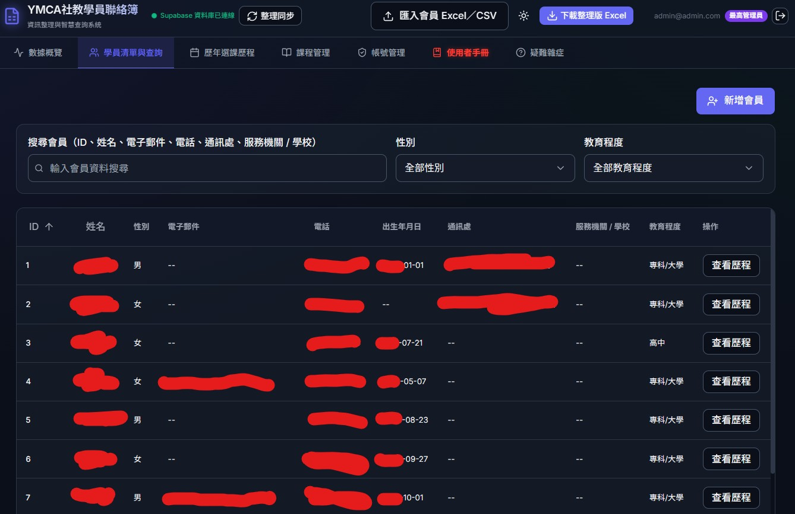
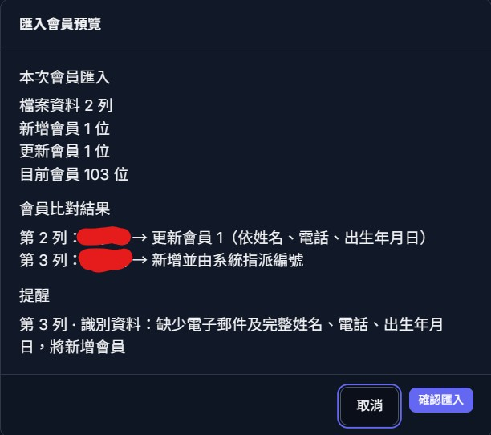

<h1 align="center">
  Hi, I'm 天友 (Tian-You)
  <br/>
  
</h1>

<p align="center">
  
  
  
</p>

<p align="center">
  A practical developer who values implementation and problem-solving over theory alone.<br/>
  I build software that solves real problems — starting from <strong>user needs and actual workflows</strong>,<br/>
  then translating requirements into technical solutions through continuous testing and iteration.
</p>

<p align="center"><em>Build. Verify. Improve.</em></p>

---

## 

I'm **林天友 (Tian-You Lin)**, an Information Management student at **National Kaohsiung University of Science and Technology (NKUST)**, from Changhua, Taiwan.

I believe technical ability comes from **continuous accumulation and hands-on verification**. When facing unfamiliar domains, I start from the problem's essence and underlying logic — researching, experimenting, and validating until I build a solid understanding, rather than staying within a comfortable technical scope.

I'm also a long-time **photographer**. Photography trained me to observe environments and understand users from an outsider's perspective. This carries over into my development work — I don't just ask _"does the feature work?"_ but also consider _"is the information presented clearly? Is the workflow intuitive? Can different users actually complete their tasks in real-world scenarios?"_

-  Development driven by **user needs, workflows, and real-world context**
-  Systems delivered to **production** and used by real users
-  **AI-assisted development** as an integrated part of my workflow
-  Photography background shaping my **UI/UX awareness**
-  Emphasis on **version control, documentation, and maintainability**
-  Goal: make technology **actually solve problems** and deliver value

---

## 

### Languages


### Frontend & Backend


### Tools & Practices


### Past Experience


---

## 

###  YMCA Management Systems — Changhua YMCA

During the **2026 summer internship** at **Changhua YMCA** (via Ching-Bao Foundation), I identified operational needs and led the planning and development of **two full-stack management systems**, both now **in production use**. The systems digitized previously paper-based and manual workflows — serving staff with varying levels of digital literacy, including senior learners.

---

####  SeniorMember System

   

| | |
|---|---|
|  | Built a full-stack admin system (**6,800+ LOC, 240+ tests**) for student management, enrollment tracking, dashboards, and batch Excel import/export — digitized legacy paper-based workflows, improving data retrieval and archival efficiency by **~80%** |
|  | Designed concurrent-safe CSV import with **composite-key identity matching** and **PostgreSQL Advisory Locks**; implemented **three-tier RBAC** with **Row Level Security** |
|  | Applied layered architecture with **19 DB migrations**, custom multi-sheet Excel export engine, and **86% test-to-production code ratio** |

---

####  SocialEducationMember System

   

| | |
|---|---|
|  | Built a full-stack admin system (**7,000+ LOC, 240+ tests**) for student management, enrollment tracking, dashboards, and batch Excel import/export — digitized legacy paper-based workflows, improving data retrieval and archival efficiency by **~80%** |
|  | Extended the core system to a second center (Community Education) with additional **billing workflows**, **enrollment audit triggers**, and **28+ DB migrations (6,200+ lines SQL)** — demonstrating reusable architecture design |
|  | Designed concurrent-safe CSV import with **composite-key identity matching** and **PostgreSQL Advisory Locks**; implemented **three-tier RBAC** with **Row Level Security** |

---

#### My Role (Both Systems)

| | |
|---|---|
|  | Requirements gathering, feature planning, system architecture & data structure design |
|  | Development workflow planning & management |
|  | AI-assisted development integrated into the full workflow |
|  | Code review, testing, debugging & integration — all my responsibility |
|  | UX adjustments based on direct feedback from staff and senior learners |

>  Source code is not publicly available due to project privacy and data protection policies.

<details>
<summary>
  
</summary>

<br/>

<h4>SeniorMember System</h4>

<p>
  
  &nbsp;
  
</p>
<p align="center"><sub><b>Left:</b> Dashboard — Seasonal overview & KPI metrics &nbsp;|&nbsp; <b>Right:</b> Student List — Full-text search & multi-dimensional filtering</sub></p>

<p>
  
</p>
<p align="center"><sub>CSV Import Preview — Batch validation with new/update statistics</sub></p>

<h4>SocialEducationMember System</h4>

<p>
  
  &nbsp;
  
</p>
<p align="center"><sub><b>Left:</b> Dashboard — KPI, enrollment trends & demographic analysis &nbsp;|&nbsp; <b>Right:</b> Student List — Member search & data management</sub></p>

<p>
  
</p>
<p align="center"><sub>Member Import — Composite-key identity matching & validation</sub></p>

>  Sensitive data has been redacted in all screenshots.

</details>

---

###  PhotoSorter

**PhotoSorter** is a practical tool designed to organize and manage photo files more efficiently — built from a real need in file and image management workflows.

| | Highlights |
|---|---|
|  | Automatic photo organization by metadata |
|  | File management automation |
|  | Reduces repetitive manual work |
|  | Requirements analysis and tool planning for a specific workflow problem |

[](https://github.com/TWTooru/PhotoSorter)

---

###  Tower of Heroes

**Tower of Heroes** is a game development project exploring gameplay programming, systems design, and interactive software development.

| | Highlights |
|---|---|
|  | Gameplay development |
|  | Game system implementation |
|  | Programming logic and problem-solving |
|  | Learning through iterative development |

[](https://github.com/NKUST-SAAD-16B/The-Tower-of-Heroes)

---

## 

I position AI as a **development collaborator** — not a code generator. AI is integrated throughout my workflow, from initial brainstorming to final delivery, but I remain responsible for every decision and every line of code.

### My AI-Assisted Workflow

```
Brainstorming          Design             Implementation Plan         Development
┌──────────────┐    ┌──────────────┐    ┌──────────────────────┐    ┌──────────────┐
│ Problem &     │    │ AI generates │    │ AI generates          │    │ AI-assisted  │
│ requirement   │───▶│ design plan  │───▶│ implementation plan   │───▶│ coding with  │
│ discussion    │    │ I review &   │    │ I verify architecture,│    │ my review,   │
│ with AI       │    │ adjust       │    │ features & approach   │    │ test & debug │
└──────────────┘    └──────────────┘    └──────────────────────┘    └──────────────┘
```

### Quality Control

| | Practice |
|---|---|
|  | Pre-established **coding, UI/UX, workflow, and review guidelines** for AI context |
|  | I **review, understand, and verify** all AI-generated code |
|  | Manual testing, debugging, and integration — my responsibility |
|  | Full **Git history** tracking all modifications |
|  | AI works within **established architecture and development context** |

### What I Don't Claim

I don't claim all my code is purely hand-written. What I do ensure is that I **understand every implementation, evaluate every solution, test every result, and maintain every system** I deliver.

>  **AI is a collaborator. Understanding, quality, and responsibility remain mine.**

---

## 

###  Changhua YMCA — System Development Intern (Summer 2026)

Via Ching-Bao Foundation internship program. Planned and developed two student management systems now in production. Communicated directly with staff and senior learners to gather requirements and iterate on UI/UX based on real feedback.

_→ See [YMCA project details](#-ymca-student-management-system--changhua-ymca) above._

###  NKUST — Public Relations Center, Student Worker

Managed large volumes of news information and supported major campus events (graduation ceremonies, anniversary celebrations). Key experiences:

| | |
|---|---|
|  | Handled high-pressure, real-time problem-solving (e.g., solo-managed seating for 100+ graduates during weather disruption) |
|  | Translated complex information for diverse audiences across departments |
|  | Applied communication skills to IT support — understanding user problems before proposing technical solutions |

---

## 

| | Area |
|---|---|
|  | Full-stack development (React + Supabase) |
|  | Python development |
|  | Software engineering practices |
|  | Git workflow & version management |
|  | System architecture & maintainable code |
|  | AI-assisted development workflow |
|  | Debugging and problem-solving |

---

## 

I believe that programming is best learned by **building things that solve real problems**.

What I've built is not just proficiency in a single language, but a complete development mindset:

> **Understand the problem → Analyze requirements → Design architecture → Collaborate with AI → Implement & verify → Maintain & improve**

The goal of development isn't just to write working code — it's to make technology **genuinely solve problems and deliver real value to users**.

---

## 

<p align="center">
  
  
</p>

---

## 

If you'd like to connect or discuss a project, feel free to reach out.

| | Channel |
|---|---|
|  | [@TWTooru](https://github.com/TWTooru) |
|  | qwe123rrcc@gmail.com |
|  | [Tain-You Lin](https://www.linkedin.com/in/tain-you-lin-8b845b380/) |

---

<p align="center">
  
</p>
